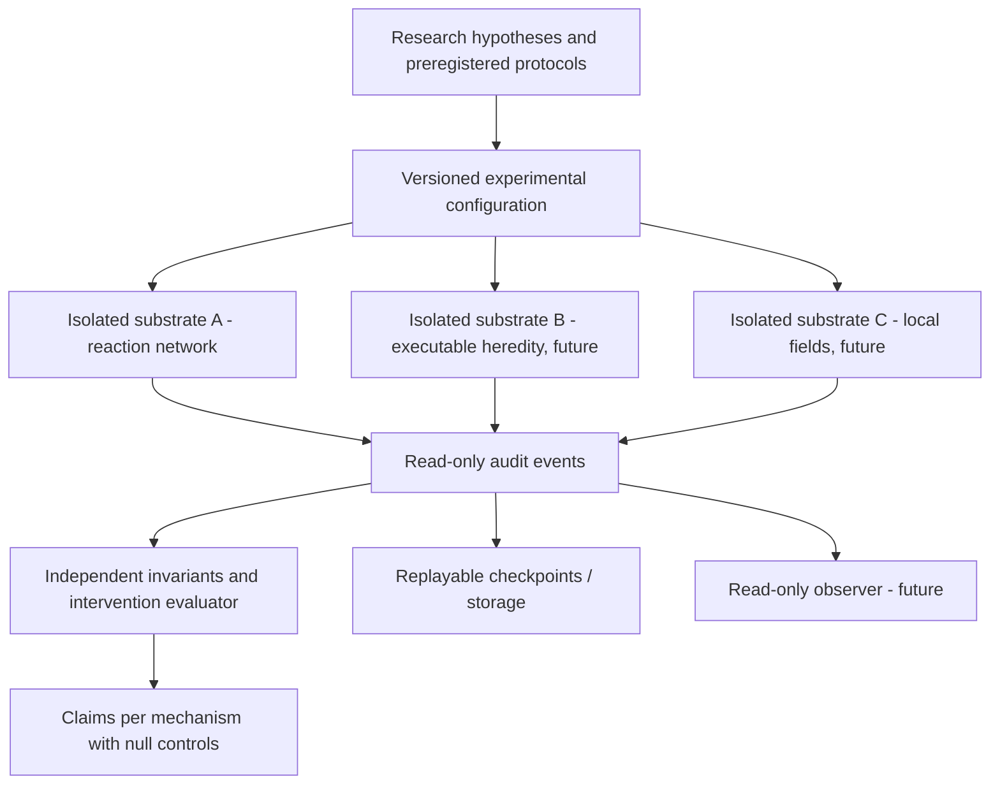

# Ora2.0 — Candidate experimental system design, not a chosen artificial organism

**Decision status 2026-10-08:** the only proposed implementation is a **measurement-calibration laboratory**. An organism architecture is **not selected** and artificial life is **not claimed**.

## Primary architecture: experiment boundary, not organism blueprint

**Core invariant:** the observer or metrics cannot issue world actions, alter data, or secretly revive an extinct population. All experimental agents (if later built) are isolated inside their specified virtual physics; no host/network permissions.

### Deliberate decoupling

1. **Physical substrate:** owns states and transitions; each variant may use its own state representation and time semantics.
2. **Experimental protocol:** chooses interventions, seeded initial conditions, run horizon, variants, holdouts, and analysis plan.
3. **Trace:** transparent events and state hashes for independent replay/forensics; don't treat metrics as organism state.
4. **Evaluator:** independent calculations with negative/null controls; never supply its metrics as a hidden organism reward.
5. **Visualization:** reads validated snapshots but cannot define truth.
6. **Persistence:** experiment-specific durable state with exact revision and manifest; resuming is conditional on replay/recovery tests.
7. **Research claims:** recorded only after measured results, with caveats and negative outcomes visible.

### Scientific axes, kept distinct

- **Within-run state:** persistence, resource use, constituent flux, perturbation repair.
- **Cross-generation:** reproduction, lineage identity, inherited variation, causal functional retention.
- **Across-ecology:** niches, interactions, exchange, novel viable affordances.
- **Across-change:** adaptability to novel environments and perturbations.
- **Across-time:** whether functional novelty continues rather than saturates.

Do not collapse these axes to a single "alive" or "intelligence" score.

### What the first calibration leaves unknown

Well-mixed reactions do not define a spatial organism boundary; counting integer species does not establish real thermodynamic metabolism; an externally designed catalyst loop does not spontaneously originate; repeated reagent production is not parent–offspring reproduction; persistent files are not memory in the cognitive sense.

### Decisions intentionally deferred

Specific evolutionary encoding; reaction-genome mapping; externally scored novelty; sensor/motor interfaces; neural vs non-neural implementation; habitat size; web dashboard style; continual mutation/self-modification; runtime infrastructure and budgets.

### Advancement gates

- **G0:** literature and hypotheses documented, assumptions and controls explicit.
- **G1:** reactor calibration passes replay/conservation checks, audit reproducible; even a scientifically negative outcome is a completed experiment.
- **G2:** independently measured functional heredity in a distinct substrate vs nulls.
- **G3:** discovered resource-funded organization under random rather than hand-selected mechanism, robust to internal ablations.
- **G4:** evidence for cross-environment adaptation / evolving ecological interactions.
- **G5:** long-horizon functional novelty with independent multi-seed tests; finite evidence only.

These are *evidence gates*, not automatically advancing phases or assertions of digital life.

## Local-computer readiness

Initially Python 3.11+ standard library, CPU-only and no external data/network. Keep GitHub source and test history separate from machine-owned run outputs and backups. Future hardware connection requires an explicit, least-privilege integration and a security review; GitHub does not supply an always-on organism runtime.
